<!--
  README.md — auto-generated by scripts/gen_readme.py
  Do not edit this file by hand.  Run generate_all.py to regenerate.

  Layout rules that work on GitHub:
    · <h1>/<h2> draw a full-width rule — use <h3> for unlined headings.
    · inline style= is stripped from README HTML — layout via <table> and  .
    · <table> is the only reliable two-column layout.
    · valign="top" aligns panels to the top of the table cell.
    · SVGs are served as  — no JS, no CSS vars, animations via SMIL/keyframes.
-->

<h3>⬛ &nbsp; saumil-777 &nbsp; ⬛</h3>

  

<table>
<tr>
<td valign="top">

</td>
<td valign="top">

</td>
</tr>
</table>

 

&nbsp;

&nbsp;

